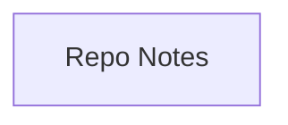

## Stack
Not a code project. Repo contains no manifest (no package.json/go.mod/pyproject.toml/Cargo.toml), no source files, and no entry points — only README.md and .git.

## Directory map
| path | what lives there |
|---|---|
| README.md | Repo description (personal skills-learning notes topic list) |
| .git | Git metadata |

## Diagram

## Component index
- [[Repo_Notes]] — the only content in this repo

## Entry points
- Dev: none — no code present
- Prod: none — no code present

## Conventions
None observed — repo contains only README.md.

## Where things go
- To add actual project content, first establish a directory structure and a manifest appropriate to the intended stack (none currently exists).
- To update the description, edit README.md.
